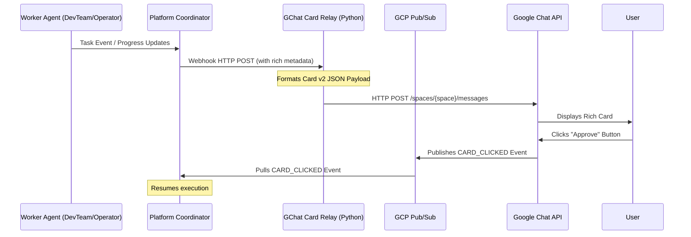

# Technical Design: Interactive Google Chat Cards v2

This document describes the design and implementation path for introducing interactive Google Chat Cards v2 into the `kube-agents` harness.

---

## 1. Architecture Overview

Currently, the Platform Agent streams thought logs and notifications to Google Chat using simple string templates. To support interactive cards with widgets, buttons, and logging links, we will implement a card formatter/relay service:



---

## 2. Phase 1: Outbound Cards Delivery (Visuals & Logging Links)

We will deploy a custom script `/opt/data/scripts/gchat_card_relay.py` inside the Platform Agent container to intercept webhook notifications from `hermes` and format them as Cards v2.

### Step 1: Update Webhook Routes in `config.yaml`

Change `config.yaml` to route events to our local relay service rather than standard text delivery:

```yaml
platforms:
  webhook:
    enabled: true
    extra:
      host: "0.0.0.0"
      port: 8644
      routes:
        # Route: Rich Task Progress & Handoff
        swarm-task-done:
          secret: "k8s-swarm-secret-999"
          events: ["TaskFinished"]
          deliver_only: true
          deliver: "http://localhost:8645/card-delivery" # Points to relay
```

### Step 2: Implement `gchat_card_relay.py`

This script listens on port `8645` and translates events into Card v2 templates.

```python
# /opt/data/scripts/gchat_card_relay.py
import json
import os
import requests
from flask import Flask, request, jsonify
from google.oauth2 import service_account
import google.auth.transport.requests

app = Flask(__name__)

# Google Chat OAuth Scopes
SCOPES = ["https://www.googleapis.com/auth/chat.messages"]

def get_chat_client():
    """Get authenticated Google API credentials via Workload Identity."""
    creds, _ = google.auth.default(scopes=SCOPES)
    auth_req = google.auth.transport.requests.Request()
    creds.refresh(auth_req)
    return creds.token

def build_card_v2(event_type, worker_id, data):
    """Compile Google Chat Card v2 Payload."""
    project_id = os.environ.get("GOOGLE_CHAT_PROJECT_ID", "default-project")

    # Standard Card Header
    card = {
        "header": {
            "title": f"Agent {worker_id}",
            "subtitle": "Task Progress Update",
            "imageUrl": "https://fonts.gstatic.com/s/i/short-term/release/googlesymbols/terminal/default/24px.svg"
        },
        "sections": []
    }

    # Add State-specific widgets
    if event_type == "TaskFinished":
        card["sections"].append({
            "header": "Status: Complete ✅",
            "widgets": [
                {
                    "textParagraph": {
                        "text": f"Worker successfully completed its task.<br><b>Outputs:</b><br>{data.get('outputs', '')}"
                    }
                },
                {
                    "buttonList": {
                        "buttons": [
                            {
                                "text": "View In Logs Explorer",
                                "onClick": {
                                    "openLink": {
                                        "url": f"https://console.cloud.google.com/logs/query;query=resource.type%3D%22k8s_container%22?project={project_id}"
                                    }
                                }
                            }
                        ]
                    }
                }
            ]
        })
    # Add other states (TaskStarted, ActionApproval, TaskFailed)
    return {"cardsV2": [{"cardId": "task-status-card", "card": card}]}

@app.route('/card-delivery', methods=['POST'])
def handle_card_delivery():
    payload = request.json
    worker_id = payload.get("worker_id")
    event_type = payload.get("event")

    card_payload = build_card_v2(event_type, worker_id, payload)

    # Retrieve GChat destination thread metadata
    space_id = payload.get("user_space")
    thread_id = payload.get("user_thread")

    token = get_chat_client()
    headers = {
        "Authorization": f"Bearer {token}",
        "Content-Type": "application/json"
    }
    url = f"https://chat.googleapis.com/v1/{space_id}/messages?messageReplyOption=REPLY_MESSAGE_FALLBACK_TO_NEW_THREAD"
    if thread_id:
        card_payload["thread"] = {"name": f"{space_id}/threads/{thread_id}"}

    resp = requests.post(url, json=card_payload, headers=headers)
    return jsonify({"status": "delivered", "gchat_code": resp.status_code})

if __name__ == '__main__':
    app.run(host='0.0.0.0', port=8645)
```

---

## 3. Phase 2: Inbound Interaction handling (Interactive Approvals)

When cards display buttons (e.g. `[Approve Namespace]`), clicking them triggers a Google Chat event.

### Step 1: Render Approval Buttons

Modify the Card generator to add interaction payloads:

```json
{
  "text": "Approve Workspace Provisioning",
  "onClick": {
    "action": {
      "actionMethodName": "approve_provision",
      "parameters": [
        {
          "key": "workspace_id",
          "value": "devteam-mercury-dice-dev"
        }
      ]
    }
  }
}
```

### Step 2: Handle `CARD_CLICKED` events in the Pub/Sub Listener

Since `hermes-agent`'s Google Chat plugin listens to the Pub/Sub topic subscription, we must intercept the incoming messages to process button actions:

1. **Pub/Sub event type check**: Google Chat publishes the event with `"type": "CARD_CLICKED"`.
2. **Action execution**: When a `CARD_CLICKED` event with `actionMethodName: "approve_provision"` arrives, the integration handler writes an approval receipt:
   ```bash
   echo "APPROVED" > /opt/data/approvals/devteam-mercury-dice-dev.receipt
   ```
3. **Task Resume**: The Platform Agent script (which is looping or scheduled to check on progress) reads the receipt file and resumes the deployment.
4. **Update Card State**: Update the original card to replace the button with a green text widget: `Provisioning Approved by User`.
