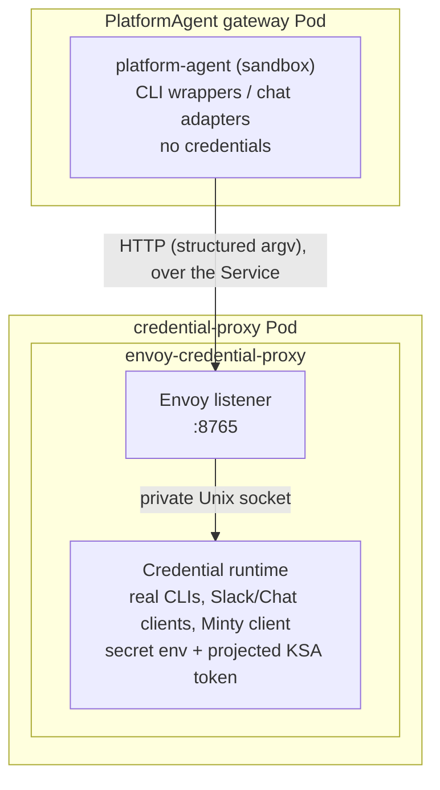

The PlatformAgent sandbox container never receives API keys, access tokens, refresh tokens, or Kubernetes ServiceAccount tokens through its environment or filesystem. Credentials live exclusively in a trusted **credential-proxy Pod**, and the sandbox reaches credentialed capabilities only through a policy-enforced proxy.

This page summarizes the architecture. The canonical design — including scope, deny-policy details, migration steps, and CI verification assertions — is [`docs/credential-isolation-design.md`](https://github.com/gke-labs/kube-agents/blob/main/docs/credential-isolation-design.md).

## Pod anatomy

Each PlatformAgent runs as one long-lived gateway Pod plus a credential-proxy Pod of its own.
`agent-api-auth` is a **native sidecar** — an `initContainers` entry with `restartPolicy: Always`,
needing Kubernetes 1.29+ — so it starts before the gateway's other containers and does not appear
in `spec.containers`:

| Container                  | Pod              | Trust level | Role                                                                                                                                                                   |
| -------------------------- | ---------------- | ----------- | ---------------------------------------------------------------------------------------------------------------------------------------------------------------------- |
| `platform-agent`           | gateway          | Untrusted   | The agent sandbox — credential-free env and mounts, CLI wrappers.                                                                                                      |
| `agent-api-auth`           | gateway          | Trusted     | Authenticates the PlatformAgent API, and hosts the event watcher, which forwards cluster events using its own separate Kubernetes-API token. Holds no credential path. |
| `fluent-bit`               | gateway          | Trusted     | Log forwarding.                                                                                                                                                        |
| `platform-agent-dashboard` | gateway          | Untrusted   | Optional local dashboard (also credential-free).                                                                                                                       |
| `envoy-credential-proxy`   | credential-proxy | Trusted     | Envoy, the credentialed command runtime, and the Slack and Google Chat relays.                                                                                         |



The sandbox image contains only **wrapper binaries** for `gcloud`, `kubectl`, `gh`, and `git`. A wrapper sends the executable name and argument array to Envoy at `CREDENTIAL_PROXY_URL`; the credential runtime executes the corresponding real CLI and returns output and exit status. It never evaluates an agent-supplied shell command, and the runtime's Unix socket is mounted only in the credential-proxy Pod, so the sandbox cannot bypass Envoy. The real credential-aware CLIs ship in a separate `credential-proxy` image that the sandbox never runs.

**The sandbox environment does not cross the boundary.** The command runs with an environment the proxy builds itself, so exporting a variable in the agent shell has no effect on the proxied process. Two values can be carried explicitly in the request instead, and both must resolve inside the shared agent workspace or the request is rejected with `400`:

- **Working directory** — so relative paths in `git` and `kubectl` arguments mean what the agent intends.
- **`KUBECONFIG`** — how a Cluster Agent profile pins itself to one target cluster. Without a `KUBECONFIG`, commands use the context the proxy bootstrapped for the host cluster.

Both are paths, so both are sent only when the caller and the proxy share a filesystem — that is, when the proxy is on loopback. A caller in another Pod sends neither, and the proxy runs the command in its own workspace directory against its bootstrapped context. This is why proxied `git` does not work from the shell sandbox: the lease check below is a statement about a directory the proxy can see.

**A kubeconfig names a cluster; it never supplies content.** The pin lives on the shared volume, so it is a document the agent can write — and a kubeconfig is executable configuration, not passive data. Fields such as `users[].user.exec.command`, `clusters[].cluster.server`, and `users[].user.tokenFile` would respectively run a program next to the credentials, redirect the minted access token, and disclose a proxy-side file as a bearer token. None of it is visible to the [command policy](#request-paths), whose rules match on the argument array: the argv is only ever `kubectl get pods`. The design doc has the [full enumeration and the reasoning](https://github.com/gke-labs/kube-agents/blob/main/docs/credential-isolation-design.md#agent-supplied-kubeconfigs).

So the proxy reads exactly one string out of the file the agent wrote, `current-context`, accepts it only if it is a well-formed `gke_<project>_<location>_<cluster>` name, and regenerates the kubeconfig itself with `gcloud container clusters get-credentials` into a directory mounted only in the credential-proxy Pod. That regenerated file is what every proxied command runs against. The same substitution is applied to a `--kubeconfig` flag, which kubectl prefers over the environment. `get-credentials` is the one command allowed to author a kubeconfig: it writes into the proxy's own directory and the result is copied out to the workspace afterwards, so the visible pin still exists for the agent to inspect without ever being what a later command opens.

Naming a cluster is not extra authority — `get-credentials` is bound by the same IAM the proxy already runs under, so it can only reach clusters this identity could reach anyway. A pin the proxy cannot regenerate from (no `current-context`, a non-GKE context name, a merged `path1:path2` list) is rejected with `400` rather than honored.

**Tree-mutating `git` runs only inside a leased workspace.** Containment to the shared volume keeps the agent off the proxy's filesystem; it says nothing about keeping concurrent agents off each other, and a Pod runs six audit crons alongside every kanban worker. A skill takes a lease and works in a private clone under `/opt/data/gitops/<lease>/<owner>__<name>`; the proxy refuses `git add`, `commit`, `checkout`, `push`, `reset` and the other verbs that write a working tree or a remote ref unless the resolved directory — after any `-C` redirect — sits under one holding a `.lease` marker. Read verbs, `fetch`, and `clone` are unaffected. The refusal comes back as `SECURITY_POLICY_BLOCKED` with rule `git.workspace.lease`, and `CREDENTIAL_PROXY_REQUIRE_GIT_LEASE=0` disables the check for an unmigrated skill.

This is a floor, not an ownership check: the wrapper sends an argument array and a working directory, never a caller identity, so the proxy can tell that a push is happening inside _some_ lease but not whose. Whether the lease is the caller's own is checked in the sandbox by the skill that holds it. [`docs/designs/gitops-workspace-leases.md`](https://github.com/gke-labs/kube-agents/blob/main/docs/designs/gitops-workspace-leases.md) is canonical for the layout and the reaper.

**`kubectl` and `gcloud` are read-only by default.** The proxy enforces that `kubectl` may not run mutating verbs like `delete`, `create`, `patch`, or `rollout restart`, and that `gcloud` may not run commands that change cloud resources. It refuses the flags that would change which identity a command authenticates as or which server receives the credential — `--as`, `--server`, `--token`, `--kuberc`, `--insecure-skip-tls-verify` and their `gcloud` equivalents — and the refusal comes back as `SECURITY_POLICY_BLOCKED` with a rule such as `kubernetes.read-only` or `kubernetes.identity-change-forbidden`.

**How much this allowlist is carrying depends on the permission set.** On a default `read-only` install it is the outermost of three layers, not the whole control: the agent's KSA holds no write verb on workloads or cluster state, so the API server refuses a mutation the allowlist missed, and the GSA holds `container.viewer`/`container.clusterViewer` only, so a `gcloud` mutation is refused at GCP. [Security and IAM](/kube-agents/reference/security-and-iam/) is canonical for what the agent may and may not do; this page describes only the proxy's own layer.

Under the opt-in `gke-admin` set that stops being true. `roles/container.admin` authorizes the agent through IAM regardless of its Kubernetes RBAC, so both layers beneath the allowlist fall away and a command it fails to refuse runs with the sidecar's full credential. Treat the allowlist as the only control in that configuration.

Kubernetes impersonation is planned and not yet deployed; once it ships, the API server will authorize each request as the requesting human user rather than as the agent. Note also that the current deployment shares one Google service account across every agent — that is the gap impersonation closes, not a mitigation.

A first deployment in a live environment will find read-only commands nobody anticipated. The fix is to add the verb to the allowlist in `command_policy.py` and ship it; that keeps the change reviewable and scoped to the one command that was missing. Report the blocked command to your infrastructure team with the rule id from the refusal.

## Credential placement

| Data                             | Sandbox                | Credential proxy          |
| -------------------------------- | ---------------------- | ------------------------- |
| `spec.deployment.env`            | No                     | Yes                       |
| Slack tokens                     | No                     | Yes, Secret-backed env    |
| PlatformAgent external API key   | No                     | Yes, Secret-backed env    |
| Session KV API key and HMAC salt | Yes, Secret-backed env | Yes, API key only         |
| Automatic KSA token mount        | Disabled               | Disabled                  |
| Explicit projected KSA token     | Not mounted            | Read-only, one-hour token |
| gcloud/kubectl configuration     | No                     | Private `emptyDir`        |
| GitHub installation token/cache  | No                     | Private `emptyDir`        |
| Agent workspace                  | Yes                    | Yes, for proxied commands |

`SESSION_KV_API_KEY` and `SESSION_KV_SALT` are the sandbox's only Secret-backed environment variables, and both are pod-scoped: neither opens anything outside this Pod. They cannot sit behind the proxy because the sandbox is the _server_ here — `session_kv_server.py` binds `127.0.0.1:8699` and needs the key in order to reject callers that are not the event watcher, the Platform MCP server, the `incident_context` plugin, or the gateway's kanban notifier — and because the salt hashes chat identities before they are written, which has to happen where the identity already is. The design doc has the [full reasoning](https://github.com/gke-labs/kube-agents/blob/main/docs/credential-isolation-design.md#the-loopback-only-exception). Both are optional in the sense that the pod starts without them, and one of them is not optional in practice: the `k8s-event-watcher` in the `agent-api-auth` sidecar authenticates with `SESSION_KV_API_KEY` and treats an empty value as fatal, so it exits on every start and no cluster events are watched at all — the container stays Ready, so its log is the only place that says so. The Session KV server also answers `503`, and identity hashing falls back to a per-process salt with a warning.

Pod-wide `automountServiceAccountToken` is `false` on both Pods. The credential proxy's projected token uses the audience `kubeagents-credential-proxy` and expires after one hour; the event watcher gets a separate one-hour Kubernetes-API token projection, mounted in the `agent-api-auth` sidecar at the conventional in-cluster path. Neither token is mounted in the agent or dashboard containers.

## Request paths

- **CLI commands** — only `gcloud`, `kubectl`, `gh`, and `git` are accepted. The proxy rejects known credential-disclosure, credential-replacement, and self-modification operations; interactive TTY programs, unbounded streaming, sandbox-only file paths, and background processes fail closed.
- **Chat** — Slack and Google Chat adapters send credential-free payloads to Envoy; the credential runtime owns the platform tokens and performs the external API calls, enforcing user allowlists and payload limits.
- **PlatformAgent API** — the Service targets port 8643 on the `agent-api-auth` sidecar, which validates the external bearer key and forwards to the sandbox API on loopback (port 8642) with a non-secret sentinel. The real key never enters the sandbox.
- **GitHub** — the credential proxy obtains a Google OIDC identity token and calls [Minty](/kube-agents/deploy/token-minter/), which brokers a repository-scoped GitHub App installation token with a maximum one-hour lifetime. The App's private key stays in Cloud KMS.

## Guarantee and limitation

**Guarantee:** the operator does not place managed credentials in the sandbox container's environment, root filesystem, persistent agent volume, or mounted ServiceAccount token path. `spec.deployment.env` is applied to the credential proxy because it may contain credentials (only a short allowlist is copied to the sandbox — the four OpenTelemetry settings and the three `ALERT_DAILY_LIMIT_*` alert ceilings — as literal values only).

**Limitation:** in the arrangement above the credential runtime is in its own Pod, but both Pods still run under the same ServiceAccount, so the sandbox reaches the GKE metadata server and obtains the same Workload Identity the proxy uses. Moving the container was the reachability half of the change. Envoy also authenticates no caller: loopback was the access control before the split, and what guards the Service now is a NetworkPolicy, which a cluster without a policy-enforcing CNI ignores.

Setting `spec.harness.experimental.shellSandbox.enabled` together with `spec.security.workloadIdentityFederation` closes both. The credential runtime moves into the shell sandbox Pod, that Pod's ServiceAccount carries no `iam.gke.io/gcp-service-account` annotation — so the metadata server answers every container in it with an unbound principal IAM grants nothing — and the proxy takes its cloud identity from a projected token mounted in its container alone, exchanged over Workload Identity Federation. Envoy is back on loopback, which also restores proxied `git`. [`designs/agent-shell-sandboxing.md`](https://github.com/gke-labs/kube-agents/blob/main/docs/designs/agent-shell-sandboxing.md) is canonical, including the one-time Workload Identity pool setup that no install surface performs.

[`docs/security-requirements.md`](https://github.com/gke-labs/kube-agents/blob/main/docs/security-requirements.md) tracks the limitation formally.

## Troubleshooting

**Every CLI in the shell sandbox reports `credential proxy unavailable`.** The `gcloud`, `kubectl`, `gh`, and `git` commands are wrappers that forward to the credential-proxy Service. When nothing is listening there, all four fail the same way:

```text
credential proxy unavailable: [Errno 111] Connection refused
```

This is a proxy availability problem rather than an authentication one — the wrappers hold no credentials to fail with. Inspect the proxy rather than the CLI:

```bash
kubectl get pods -n kubeagents-system
kubectl logs -n kubeagents-system deploy/platform-agent-credential-proxy
```

**Diagnostics run inside the Pod are misleading while the proxy is down.** Those wrappers are the only `gcloud` and `kubectl` the sandbox has, so the commands you would normally reach for return the same connection error instead of describing the Pod's identity. Test that identity from a throwaway Pod using the same ServiceAccount:

```bash
kubectl run wi-check -n kubeagents-system --rm -it --restart=Never \
  --image=google/cloud-sdk:slim \
  --overrides='{"spec":{"serviceAccountName":"kubeagents-platform-agent"}}' \
  -- gcloud auth print-access-token
```

**The credential proxy exits during startup.** The credential runtime runs `CREDENTIAL_PROXY_BOOTSTRAP_COMMAND` before it begins serving, and a non-zero exit stops the container, so its Pod crashloops while the gateway Pod stays healthy. The command's stdout and stderr are written to its log, so `kubectl logs deploy/platform-agent-credential-proxy` carries the reason. Bootstrap failures usually mean the Pod cannot reach the cluster or mint a token; see [Security & IAM](/kube-agents/reference/security-and-iam/) for the Workload Identity binding it depends on.

## Where to go next

- [Security & IAM](/kube-agents/reference/security-and-iam/) — Workload Identity, the GCP permission sets, and the read-only Kubernetes RBAC.
- [Token minter (Minty)](/kube-agents/deploy/token-minter/) — short-lived GitHub App tokens via KMS.
- [Full design doc](https://github.com/gke-labs/kube-agents/blob/main/docs/credential-isolation-design.md) — scope, deny policy, migration, and CI verification assertions.
